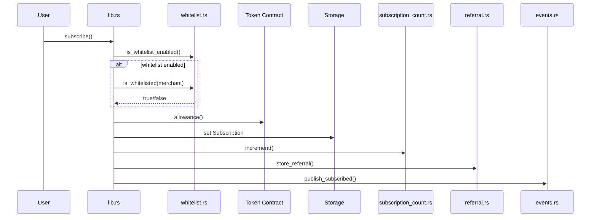
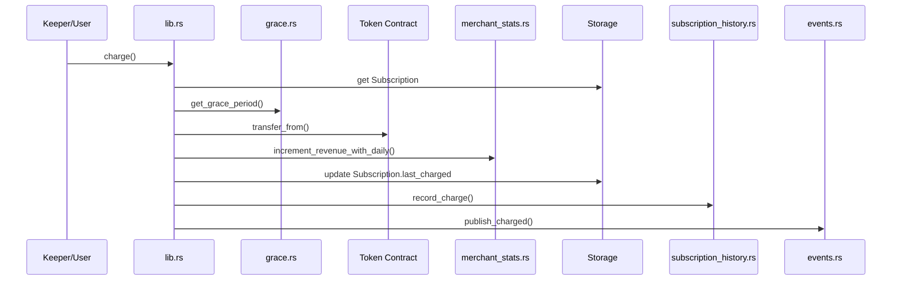
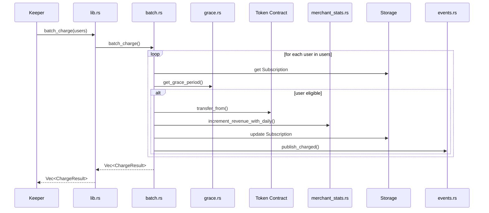

# Architecture

This document describes the system design of FlowPay — how the contract is structured, how data is stored, and how the frontend and contract interact.

---

## Overview

FlowPay is composed of two parts:

1. **Smart Contract** — a Soroban contract written in Rust that lives on the Stellar blockchain. It is the single source of truth for all subscription state.
2. **Frontend** — a React + TypeScript single-page application that lets users interact with the contract through the Freighter browser wallet.

There is no centralised backend. The only off-chain component required is a **keeper service** — a simple scheduler that calls `charge()` on behalf of merchants when a billing interval elapses.

```
┌─────────────────────────────────────────────────────────┐
│                        User Browser                      │
│                                                          │
│   ┌──────────────┐        ┌──────────────────────────┐  │
│   │   React UI   │──────▶ │  Freighter Wallet        │  │
│   │  (Vite/TS)   │◀────── │  (signs transactions)    │  │
│   └──────┬───────┘        └──────────────────────────┘  │
│          │                                               │
└──────────┼──────────────────────────────────────────────┘
           │ signed XDR
           ▼
┌─────────────────────────────────────────────────────────┐
│                  Stellar Testnet / Mainnet               │
│                                                          │
│   ┌──────────────────────────────────────────────────┐  │
│   │              FlowPay Contract                    │  │
│   │                                                  │  │
│   │  initialize()   subscribe()   charge()           │  │
│   │  cancel()       pay_per_use() get_subscription() │  │
│   └──────────────────────────────────────────────────┘  │
│                                                          │
│   ┌──────────────────────────────────────────────────┐  │
│   │         Token Contract (SAC / XLM)               │  │
│   │         transfer_from() — moves funds            │  │
│   └──────────────────────────────────────────────────┘  │
└─────────────────────────────────────────────────────────┘
           ▲
           │ calls charge() on schedule
┌──────────┴──────────┐
│   Keeper Service    │
│  (cron / Lambda)    │
└─────────────────────┘
```

---

## Contract Module Structure

```mermaid
graph TD
    lib["lib.rs (Entry Point)"]
    admin["admin.rs"]
    batch["batch.rs"]
    events["events.rs"]
    fee["fee.rs"]
    grace["grace.rs"]
    merchant_stats["merchant_stats.rs"]
    migration["migration.rs"]
    referral["referral.rs"]
    spending_limit["spending_limit.rs"]
    storage["storage.rs"]
    subscription_count["subscription_count.rs"]
    subscription_history["subscription_history.rs"]
    subscription_metadata["subscription_metadata.rs"]
    trial["trial.rs"]
    validation["validation.rs"]
    whitelist["whitelist.rs"]

    lib --> admin
    lib --> batch
    lib --> events
    lib --> fee
    lib --> grace
    lib --> merchant_stats
    lib --> migration
    lib --> referral
    lib --> spending_limit
    lib --> storage
    lib --> subscription_count
    lib --> subscription_history
    lib --> subscription_metadata
    lib --> trial
    lib --> validation
    lib --> whitelist

    batch --> events
    batch --> grace
    batch --> merchant_stats
```



## Data Flow for Key Functions

### subscribe()


### charge()


### batch_charge()


---

## Smart Contract Design

### Entry Points

| Function | Mutates State | Auth | Description |
| --- | --- | --- | --- |
| `initialize(token)` | Yes | None | One-time setup. Stores the token contract address. Panics if called again. |
| `subscribe(user, merchant, amount, interval)` | Yes | `user` | Creates or overwrites a subscription for the caller. Increments `ActiveCount`. |
| `charge(user)` | Yes | None | Permissionless. Transfers funds if the interval has elapsed. Tracks merchant revenue. |
| `batch_charge(users)` | Yes | None | Permissionless. Charges multiple users in one transaction; skips ineligible users. |
| `pay_per_use(user, amount)` | No (token state only) | `user` | Instant transfer against an active subscription. Enforces daily limit if set. Tracks merchant revenue. |
| `cancel(user)` | Yes | `user` | Sets `active = false`. Decrements `ActiveCount`. |
| `get_subscription(user)` | No | None | Read-only view. Returns `Option<Subscription>`. |
| `get_active_count()` | No | None | Returns the running total of active subscriptions. |
| `get_merchant_revenue(merchant)` | No | None | Returns cumulative revenue for a merchant address. |
| `set_daily_limit(user, limit)` | Yes | `user` | Sets a daily spending cap for `pay_per_use()`. Stored in temporary storage. |
| `get_daily_limit(user)` | No | None | Returns the current daily spending cap for `pay_per_use()` or `None` if unset. |
| `get_daily_spent(user)` | No | None | Returns today's amount spent via `pay_per_use()`. |

### Why `charge()` has no auth

`charge()` is intentionally permissionless. Any account — including a keeper bot — can call it. The contract enforces correctness:

- The subscription must exist
- `active` must be `true`
- `now >= last_charged + interval` must hold

If any condition fails, the transaction panics and no funds move. This design means merchants don't need to hold keys on a server — they can delegate charging to any keeper.

---

## Data Model

### `Subscription` struct

```rust
pub struct Subscription {
    pub merchant: Address,   // who receives the payment
    pub amount: i128,        // stroops per period (1 XLM = 10_000_000)
    pub interval: u64,       // seconds between charges
    pub last_charged: u64,   // ledger timestamp of last successful charge
    pub active: bool,        // false = cancelled
}
```

### `DataKey` enum

```rust
pub enum DataKey {
    Subscription(Address),      // keyed by subscriber address
    Token,                      // the token contract address (set at init)
    ActiveCount,                // running total of active subscriptions
    MerchantRevenue(Address),   // cumulative revenue per merchant
    DailyLimit(Address),        // user-set daily pay_per_use cap (temporary)
    DailySpent(Address),        // amount spent today via pay_per_use (temporary)
}
```

---

## Storage Strategy

Soroban has three storage tiers. FlowPay uses all three:

| Tier | Used For | Why |
| --- | --- | --- |
| `instance` | `DataKey::Token`, `DataKey::ActiveCount` | Contract-wide config and counters. Always needed, tied to the contract's own TTL. |
| `persistent` | `DataKey::Subscription(user)`, `DataKey::MerchantRevenue(merchant)` | Records that must survive indefinitely. Persistent storage has its own TTL that is automatically extended. |
| `temporary` | `DataKey::DailyLimit(user)`, `DataKey::DailySpent(user)` | Ephemeral per-user data. Daily spending limits and the running daily spend counter are stored here with a TTL of ~1 day (17,280 ledgers). They expire automatically — no cleanup needed. |

**TTL note:** Persistent storage entries have a TTL on Stellar. FlowPay automatically calls `extend_ttl` on active subscriptions during `subscribe()` and `charge()` to prevent them from being evicted by the network.

---

## Token Flow

FlowPay never holds tokens. It uses the Soroban token interface's `transfer_from` to move funds directly from the user's account to the merchant's account, using the allowance the user pre-approved.

```
User account ──[allowance]──▶ FlowPay contract
                                    │
                              transfer_from()
                                    │
                                    ▼
                            Merchant account
```

The user must call `approve()` on the token contract before subscribing. The frontend handles this automatically as part of the subscribe flow (planned — currently the user must approve manually or via CLI).

---

## Frontend Architecture

The frontend is a minimal React SPA with no routing library. State is local to components.

```
App.tsx
├── useWallet()          — Freighter connection, signing, submission
├── SubscribeForm.tsx    — form to create a subscription
└── Dashboard.tsx        — view subscription, cancel, pay-per-use
```

All Soroban SDK calls are isolated in `stellar.ts`. Components never import `@stellar/stellar-sdk` directly. This makes it easy to swap the SDK version or mock it in tests.

### Transaction lifecycle

```
1. Component calls buildXxxTx() from stellar.ts
2. stellar.ts builds the transaction and simulates it via RPC
3. assembleTransaction() attaches auth entries from simulation
4. XDR string returned to component
5. Component passes XDR to useWallet().signAndSubmit()
6. Freighter prompts user to sign
7. Signed transaction submitted to Stellar RPC
8. Transaction hash returned and displayed
```

---

## Keeper Service

Because Soroban has no native scheduler, recurring charges require an external trigger. The recommended pattern is a simple script that:

1. Maintains a list of subscriber addresses (from contract events or a database)
2. Runs on a schedule (cron, Lambda, etc.)
3. Calls `batch_charge(users)` with a batch of subscribers whose intervals have elapsed

`batch_charge` processes each user independently — ineligible users (interval not elapsed, paused, cancelled) are skipped and recorded as `Skipped`/`Inactive`/`Paused` in the result vector without aborting the transaction. This is more efficient than individual `charge()` calls when managing many subscribers.

The contract itself enforces the interval — if the keeper calls too early, the user is simply skipped. There is no risk of double-charging.

See [DEPLOYMENT.md](DEPLOYMENT.md) for a reference keeper implementation.
